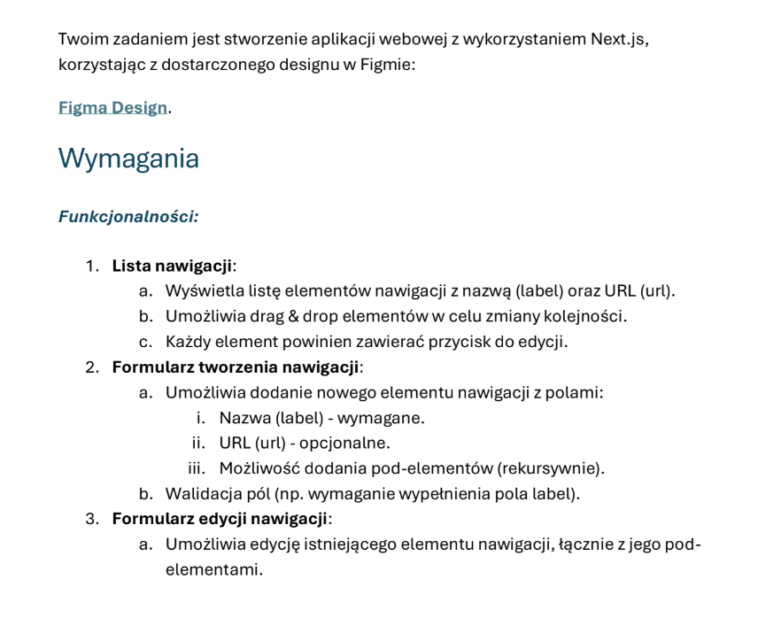
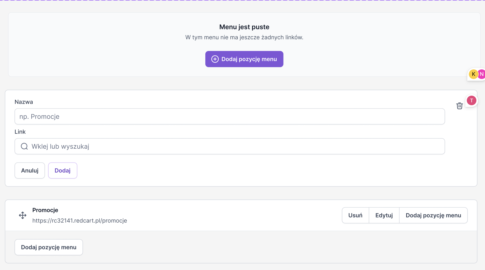
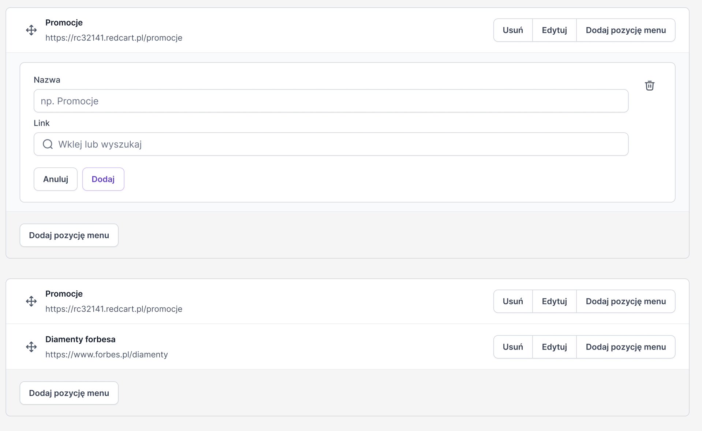
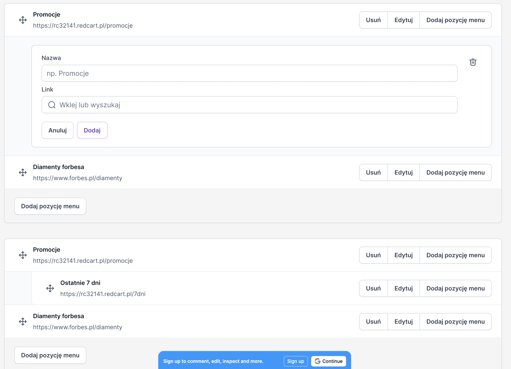
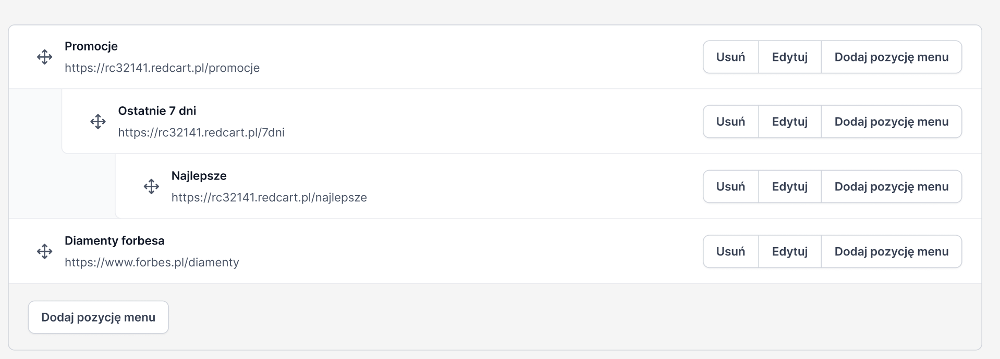

## Assessment description



Screenshots below were given.





This is a [Next.js](https://nextjs.org) project bootstrapped with [`create-next-app`](https://nextjs.org/docs/pages/api-reference/create-next-app).

## Getting Started

If you want to run development server use on of these commands:

```bash
npm run dev
# or
yarn dev
# or
pnpm dev
# or
bun dev
```

If you want to build and start docker container use this command:

```bash
docker-compose up --build
```

Open [http://localhost:3000](http://localhost:3000) with your browser to see the result.
